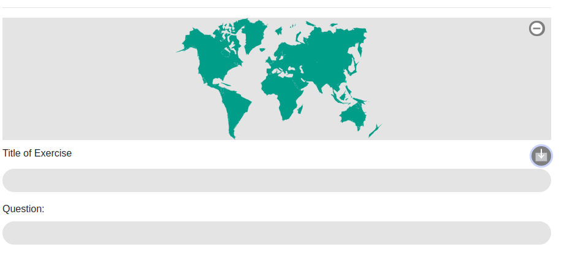
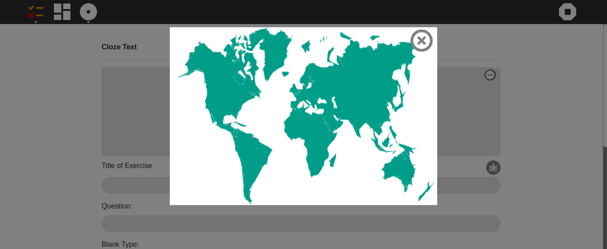

Welcome to the first week of Coding Period. As I might have mentioned earlier GSoC timeline is divided into two part - Community Bonding Period and the Coding Period. Community bonding period ended last week and this was the first week of the coding period. This is that (major) part of GSoC programme where students start working on their proposal according to the timeline they have earlier stated on their proposal. So for the next 12 weeks, I will be following my timeline and updating you about the accomplishment accordingly.  
Starting with the first week, I worked mainly in two areas -
### 1. UI Improvements for thumbnail in Exercises.
This involved working on the UI for thumbnail integration in the existing exercise templates.
An image above the title represents the thumbnail. It can be changed by clicking on the icon on the right of Title. Also, clicking on the image would open a Modal Window which would give an enlarged and detailed view of the image. This Modal window here is implemented with the use of a JS lb - [picoModal](https://github.com/Nycto/PicoModal). Later on, this modal window will also serve as an Image Editor but let's not get ahead of ourselves.

    
    

### 2. Multimedia Integration for MCQ Questions.
Until now users were only able to post a textual question in MCQ template. This feature allows them to choose from a number of multimedia options - Text, Audio, Video, Image, TextToSpeech(to be implemented) while posting a Question. Unlike other platforms where the Images are selected from the desktop directly or from some website, this involves the use of a Journal in consistence with other Sugarizer Activities. The Journal contains activities, multimedia element from the past that a user can choose from. As far as the technicality is concerned base64 encoding is used to load data from the Journal/ display and edit it. Below are some screenshots of the UI for using Multimedia in MCQ - Questions.

Text and Audio Options
  

    
    

  

Image and Video Options

    
    

  

It was great sharing this milestone with you. Looking forward to seeing you all next week. 
Have a great week ahead.